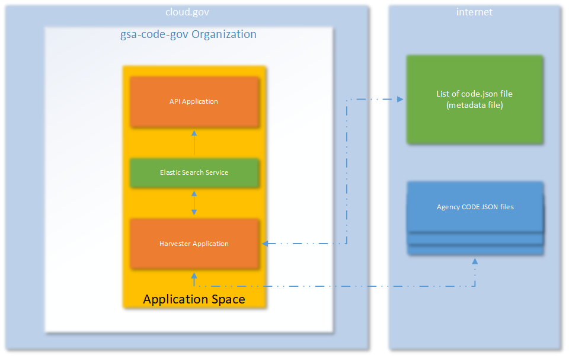

# Infrastructure (Work in Progress)

This files describes the infrastructure, server space and memory, required to run code.gov.  It breaks down the server requirements by front-end and different back-end processes.

# front end
The front-end of code.gov is currently a static site that can be found at code-gov-web.

# backend
The backend consists of following different parts and can be deployed on any

1.  Harvester
2.  API
3.  Elastic Search

All of these applications/services can be deployed on independent servers/containers and/or single server.

## Harvester
The harvester application uses meta-data json file to locate various agency code.json file.  Code.json file contains a list of various projects and their related details.  For each agency code.json file harvester reads the content, validates the format, ranks the project based on a pre-defined criteria and refreshes multiple Elastic Search indices.

The meta-data file (json) and agency code.json files can be located anywhere on the file system or internet accessible URL.  The location of the meta-data file can be configured as a part of Harvester configuration file.

Location of Elastic Search server/service is also configurable as a part of the Harvester configuration.

## API
The API application uses the data stored in Elastic Search indices and presents them API end-points.  This API end-point can be used by a front-end and/or mobile application to further render that application

Location of Elastic Search server/service is also configurable as a part of the API configuration.

## Elastic Search
Elastic Search engine is the defacto storage used by both Harvester and API applications.  Harvester application creates/updates various indices and API application reads these indexes to deliver data for its various end-points.
